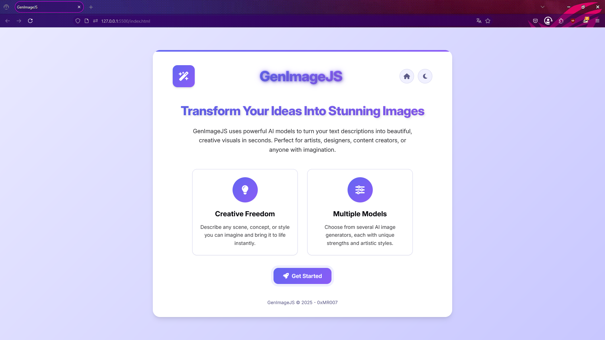
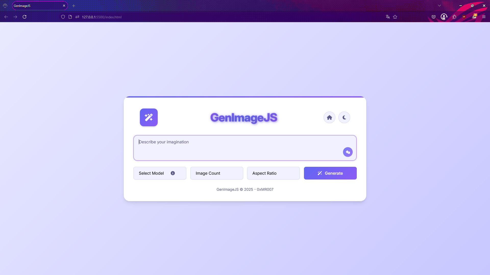
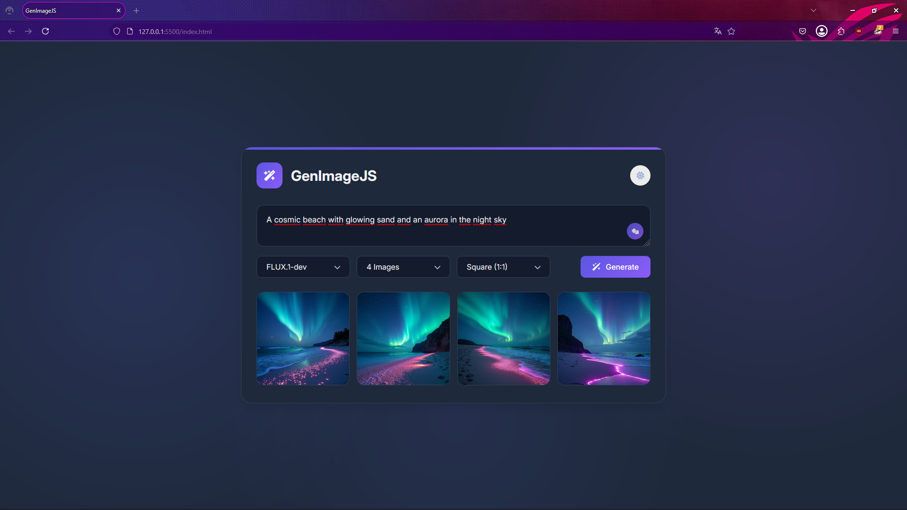

# GenImageJS 🪄

An elegant web interface for generating images using advanced AI models.

<div align="center">
  
  
  
</div>

## 🌟 Features

- Intuitive user interface with light/dark mode
- Text-to-image generation based on text descriptions
- Multiple AI models supported:
  - FLUX.1-dev and FLUX.1-schnell by Black Forest Labs
  - Stable Diffusion XL, 2.1, and 1.5
  - Stable Diffusion 3 and 3 Turbo
  - Openjourney
- Customizable image count (1-4)
- Aspect ratio selection (square, landscape, portrait)
- Random prompt suggestions
- Easy download of generated images
- Responsive design for mobile and desktop

## 🚀 Getting Started

1. Clone this repository:
```bash
git clone https://github.com/0xMR007/GenImageJS.git
cd GenImageJS
```

2. Open `index.html` in your browser or use a simple local server:
```bash
# If you have Python installed
python -m http.server

# Or with Node.js
npx serve
```

3. Set up your Hugging Face API key:
   - Create an account on [Hugging Face](https://huggingface.co/)
   - Generate an API key in your account settings
   - Replace the `API_KEY` variable in `script.js` with your key

## ⚙️ Technologies Used

- HTML5 / CSS3
- Vanilla JavaScript (ES6+)
- [Font Awesome](https://fontawesome.com/) for icons (v6.7.2)
- Hugging Face Inference API for AI model access
- Google Fonts (Inter, Poppins)

## 🏗️ Project Structure

- `index.html` - Main HTML structure
- `styles.css` - All styling and responsive design
- `script.js` - Application logic and API interactions

## 🎨 Customization

- Modify CSS variables in `:root` to change color scheme and appearance
- Add new models by updating select options in `index.html`
- Customize example prompts in the `examplePrompts` array in `script.js`
- Change transition animations by modifying CSS transitions

## ⚠️ Limitations

- Some models may not function correctly due to API limitations or model availability
- Generation quality and speed vary between different models
- Hugging Face API may have usage limits based on your account type
- Large image sizes or complex prompts may lead to longer generation times
- API key is exposed in client-side code (not secure for production)

## 📝 Notes

This project uses the Hugging Face Inference API to access image generation models. Make sure to comply with the API's terms of use and limitations.

## 📄 License

This project is licensed under the MIT License - see the LICENSE file for details.

---