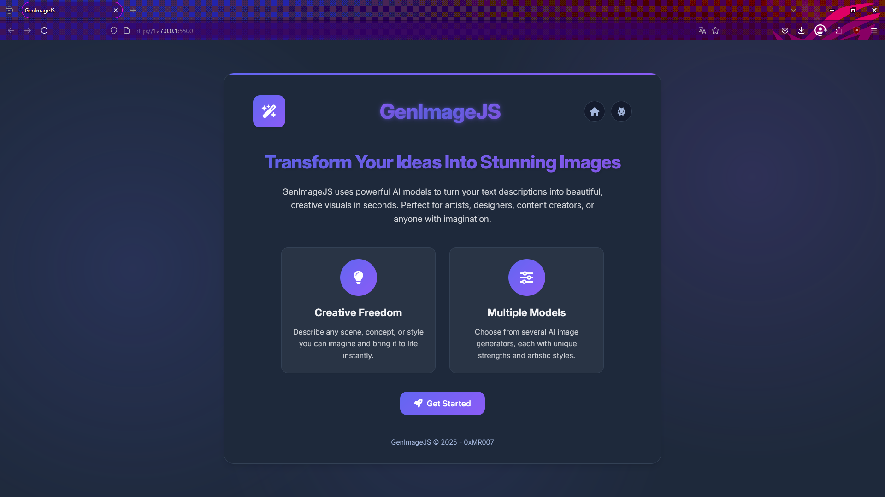

# 🎨 GenImageJS


> *Transform your imagination into stunning visuals with the power of AI*

## Table of Contents
- [Features](#features)
- [Getting Started](#getting-started)
- [Technologies Used](#technologies-used)
- [Project Structure](#project-structure)
- [Customization](#customization)
- [Limitations](#limitations)
- [Notes](#notes)
- [License](#license)

<div align="center">
  
  
  
  
  
  
  <p align="center"><i>(Preview from older version below)</i></p>
  
</div>

> ⚠️ **IMPORTANT NOTE**: When adding new models to GenImageJS, be aware that not all Hugging Face models work with the standard API endpoint format used in this application. Even models from established organizations like stabilityai or runwayml may return "Not found" errors. 
>
> Currently, the application is configured to work reliably with these specific models:
> - black-forest-labs/FLUX.1-dev
> - black-forest-labs/FLUX.1-schnell
> - stabilityai/stable-diffusion-xl-base-1.0
>
> To add more models:
> 1. First test the model manually using the Hugging Face API Inference with the exact same endpoint format as in the code
> 2. You may need to modify the API URL format in the `generateImages()` function for different model families
> 3. Some models may require different request parameters than what's currently configured

## Features
- Intuitive user interface with light/dark mode
- Text-to-image generation based on text descriptions
- Multiple AI models supported:
  - FLUX.1-dev and FLUX.1-schnell by Black Forest Labs
  - Stable Diffusion XL
- 🔢 Customizable image count (1-4)
- 📐 Aspect ratio selection (square, landscape, portrait)
- 💡 Random prompt suggestions
- ⬇️ Easy download of generated images
- 📱 Responsive design for mobile and desktop

## Getting Started
1. Clone this repository:
```bash
git clone https://github.com/0xMR007/GenImageJS.git
cd GenImageJS
```
2. Open `index.html` in your browser or use a simple local server:
```bash
# If you have Python installed
python -m http.server
# Or with Node.js
npx serve
```
3. Set up your Hugging Face API key:
   - Create an account on [Hugging Face](https://huggingface.co/)
   - Generate an API key in your account settings:
     1. Go to your Hugging Face profile
     2. Click on "Settings" in the top right corner
     3. Navigate to "Access Tokens" in the left sidebar
     4. Click "New token"
     5. Give your token a name (e.g., "GenImageJS")
     6. Select "read" access level
     7. Click "Generate token"
     8. Copy the generated token immediately (you won't be able to see it again)
   - Replace the `API_KEY` variable in `script.js` with your key

## Technologies Used
- HTML5 / CSS3
- Vanilla JavaScript (ES6+)
- [Font Awesome](https://fontawesome.com/) for icons (v6.7.2)
- Hugging Face Inference API for AI model access
- Google Fonts (Inter, Poppins)

## Project Structure
- `index.html` - Main HTML structure
- `styles.css` - All styling and responsive design
- `script.js` - Application logic and API interactions

## Customization
- Modify CSS variables in `:root` to change color scheme and appearance
- Add new models by updating select options in `index.html`
- Customize example prompts in the `examplePrompts` array in `script.js`
- Change transition animations by modifying CSS transitions

## Limitations
- Some models may not function correctly due to API limitations or model availability
- Generation quality and speed vary between different models
- Hugging Face API may have usage limits based on your account type
- Large image sizes or complex prompts may lead to longer generation times
- API key is exposed in client-side code (not secure for production)

## Notes
This project uses the Hugging Face Inference API to access image generation models. Make sure to comply with the API's terms of use and limitations.

## License
This project is licensed under the MIT License - see the LICENSE file for details.
